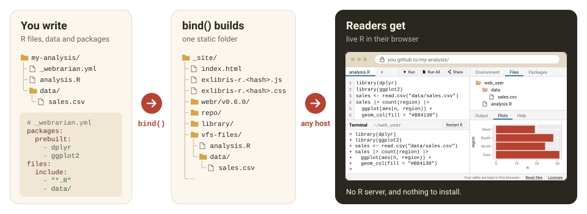

<!-- README.md is generated from README.qmd. Please edit that file -->

```{r, include = FALSE}
knitr::opts_chunk$set(
  collapse = TRUE,
  comment = "#>",
  fig.path = "man/figures/README-",
  out.width = "100%",
  # Nothing in this README runs. `bind()` downloads the webR engine,
  # `reading_room()` starts a server, and the rest write into the working
  # directory, so every chunk here is shown rather than executed.
  eval = FALSE
)
```

# webrarian <a href="https://coatless-wasm.github.io/webrarian/"><picture><source media="(prefers-color-scheme: dark)" srcset="man/figures/webrarian-logo-dark-animated.svg"></picture></a>

<!-- badges: start -->
[](https://github.com/coatless-wasm/webrarian/actions/workflows/R-CMD-check.yaml)
[](https://lifecycle.r-lib.org/articles/stages.html#experimental)
<!-- badges: end -->

<picture><source media="(prefers-color-scheme: dark)" srcset="man/figures/hero-dark.svg"></picture>

webrarian turns R scripts, data files and a list of packages into a static
website where R runs in the visitor's browser through
[webR](https://docs.r-wasm.org/webr/latest/). Nothing runs on a server, so any
static host will do.

Try the [live demo](https://coatless-wasm.github.io/webrarian/demo/).

## Installation

Install the development version from GitHub:

```{r}
#| label: install
pak::pak("coatless-wasm/webrarian")
```

`remotes::install_github("coatless-wasm/webrarian")` works too. webrarian has
three requirements:

- R >= 4.4.
- Docker, only to compile local and GitHub packages. Prebuilt packages need none.
- httpuv, to preview a site with `reading_room()`.

## Quick start

```{r}
#| label: quick-start
library(webrarian)
catalog("my-site")
acquire_package("dplyr", path = "my-site")
bind("my-site")
reading_room("my-site")
```

Add scripts and data with `acquire_file()`, and publish to GitHub Pages with
`circulate_via_github()`.

Or start from a working example:

```{r}
#| label: example
bind(collection_example("data-analysis", dest = "data-analysis-example"))
```

The examples are `"basic"`, `"branded"`, `"data-analysis"`, `"local-package"`
and `"mirror"`. Every function is listed in the
[reference](https://coatless-wasm.github.io/webrarian/reference/).

## Learn more

These articles cover the rest:

- [Getting started](https://coatless-wasm.github.io/webrarian/articles/getting-started.html)
- [Choosing webrarian](https://coatless-wasm.github.io/webrarian/articles/when-to-use.html)
- [Deployment](https://coatless-wasm.github.io/webrarian/articles/deployment.html)
- [Configuration reference](https://coatless-wasm.github.io/webrarian/articles/config-reference.html)

Every site runs exlibris, the browser workspace webrarian ships prebuilt.
pyodidarian, the Python counterpart, is released separately.

## License

AGPL-3, though the sites and mirrors webrarian generates are yours to license
as you choose (see [`LICENSE.note`](https://github.com/coatless-wasm/webrarian/blob/main/LICENSE.note)). Notices for the bundled
third-party code are in [`inst/viewer/THIRD-PARTY.md`](https://github.com/coatless-wasm/webrarian/blob/main/inst/viewer/THIRD-PARTY.md).
