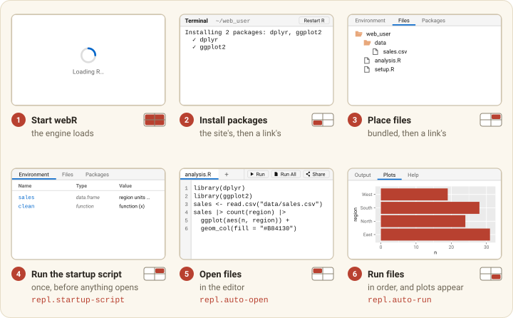

```{r}
#| include: false
knitr::opts_chunk$set(
  collapse = TRUE,
  comment = "#>",
  eval = FALSE
)
```

Apart from `_brand.yml`, every setting here lives in `_webrarian.yml`. The
[configuration reference](config-reference.html) lists them all.

## Branding with brand.yml

webrarian reads [brand.yml](https://posit-dev.github.io/brand-yml/), the
format Quarto and Shiny use, so one file can dress all three. Put a
`_brand.yml` next to `_webrarian.yml`.

```yaml
# _brand.yml
meta:
  name: "Survey Analysis"

logo:
  images:
    icon: "assets/icon.svg"
    wide: "assets/logo.svg"
  small: icon
  medium: wide

color:
  palette:
    navy: "#2C3E50"
    teal: "#18BC9C"
  primary: teal
  background: "#FFFFFF"
  foreground: navy

typography:
  fonts:
    - family: "Inter"
      source: google
  base: "Inter"
  monospace: "JetBrains Mono"
```

You can also point `brand` at a file elsewhere
(`brand: "branding/brand.yml"`), or write the brand inline.

```yaml
# _webrarian.yml
brand:
  meta:
    name: "Survey Analysis"
  color:
    primary: "#336699"
  logo: "assets/logo.png"
```

The table shows where each field appears.

| brand.yml field | Where it shows |
|-----------------|----------------|
| `meta.name` | the page title and link previews, unless `ui.meta.title` is set |
| `logo.small` | the browser tab icon |
| `logo.medium` (else `logo.large`) | the loading screen; a logo with `light` and `dark` variants shows each in its scheme |
| `color.primary` | the accent color and the loading spinner |
| `color.background` | the background, with panel headers and borders in shades of it |
| `color.foreground` | text |
| `typography.base`, `typography.monospace` | the interface font, and the editor and console font |
| `typography.fonts` | fonts to load (Google fonts by link, local files copied in) |

Other fields are ignored. `color.primary` and the fonts apply in both light
and dark mode. The background and foreground apply in light mode only, unless
both are set and the background is dark, in which case the whole palette
applies in both modes.

## Light and dark

A site follows each visitor's system setting until they choose otherwise. The
Settings gear at the right end of the footer offers Auto, Light and Dark. The
choice is kept in the visitor's browser, for that site only, and the loading
screen, the editor, the console and R's help pages all follow it.

To make a site light or dark for everyone, pin it. A pinned site has no gear.

```yaml
# _webrarian.yml
ui:
  theme: dark
```

`ui.theme` is `auto` (the default), `light` or `dark`. A brand whose palette
is dark pins its site to dark, since that one palette is all the site has;
`ui.theme: light` is then ignored with a warning.

Two things keep following the visitor's system whatever is chosen: the
scroll bars and pop-up lists the browser draws itself, and HTML output other
than help pages, such as an interactive chart.

## The loading screen

A loading screen shows first, before the workspace starts, and you choose what
it says.

```yaml
# _webrarian.yml
ui:
  loading:
    message: "Preparing your R environment..."
```

The message is plain text. For your own markup, set `custom-html` to HTML that
replaces the loading screen's contents. The screen and its status line, where
a load failure and the Reload button appear, stay.

The loading screen follows the color scheme too: dark for a visitor whose
workspace will be dark, with the brand's dark logo when it has one. A brand
with one logo shows it in both schemes. A loading screen with `custom-html`
keeps its light colors in every scheme, since what you wrote for it was made
for them.

## Page metadata

These settings fill in the page's title and its link previews.

```yaml
# _webrarian.yml
ui:
  meta:
    title: "Survey Analysis"
    description: "Explore the 2025 survey in R, in your browser"
    og-image: "assets/social-preview.png"
    site-url: "https://myname.github.io/survey-analysis/"
    twitter-card: "summary_large_image"
```

`title` defaults to the brand or project name, and `description` to
`project.description`. `og-image` takes effect only with `site-url`, because
link previews need an absolute URL.

## Custom CSS

Point `ui.custom-css` at a stylesheet inside the collection.

```yaml
# _webrarian.yml
ui:
  custom-css: "assets/custom.css"
```

The stable way to restyle the viewer is through its CSS variables.

```css
:root {
  --accent-color: #18BC9C;
  --bg-primary: #1a1a2e;
  --bg-secondary: #23233d;
  --text-primary: #eaeaea;
  --font-body: "Inter", system-ui, sans-serif;
  --font-mono: "JetBrains Mono", ui-monospace, monospace;
}
```

A palette written this way is the site's one palette, for light and dark
alike. When it is dark, as this one is, pin the site with `ui.theme: dark`, so
that the editor's syntax colors stay the ones made for a dark background and
no visitor is offered Light.

brand.yml sets the same variables, so set each in one place only. To target
one mode, write a rule for each way a page comes to be in it: by the
visitor's system, and by a choice from the Settings gear or a pinned site,
which the page carries as `data-theme` on `<html>`.

```css
@media (prefers-color-scheme: dark) {
  :root:not([data-theme="light"]) { --accent-color: #7fd1c1; }
}
:root[data-theme="dark"] { --accent-color: #7fd1c1; }
```

The loading screen uses `#webrarian-loading` and `.webrarian-spinner`. Other class
names can change between releases, so build on them at your own risk.

## Panels

All five panels are on by default, and `terminal` is the R console. Turn off
the ones a lesson does not need.

```yaml
# _webrarian.yml
repl:
  panels:
    editor: true
    terminal: true
    files: false
    plot: true
    environment: false
```

{#fig-panels fig-alt="A browser window at my-analysis.netlify.app showing the workspace. Numbered callouts mark the editor holding analysis.R, the console after installing packages and running the script, the Environment and Files tabs with the file tree under web_user, the Plots tab with a bar chart, the footer with Reset files, and the address bar"}

## Startup order

{#fig-startup fig-alt="Six close-ups of the workspace panes, in order, each with a small map of the pane it shows. Loading R, the console installing packages, the Files tab with the bundled files, the startup script's objects in the Environment tab, a file open in the editor for repl.auto-open, and the plot from the repl.auto-run code"}

`repl.startup-script`, `repl.auto-open` and `repl.auto-run` control the last
steps, and [Bundling Files](files.html#running-scripts-when-the-page-opens)
explains them. Keep startup scripts quick, because the visitor watches a
spinner while they run.

## Share links

The Share button makes a link carrying the visitor's open files.
`repl.share-links` decides what a link may do.

| Mode | A link may | Share button |
|------|------------|--------------|
| `"open"` (the default) | add files (replacing a bundled file with the same path), add packages and apply the other settings a link can carry | shown |
| `"fixed"` | add files only. One whose path matches a bundled file is saved beside it as `<name>-shared.<ext>`. Packages and settings are ignored, with one notice | shown, but its links carry files only |
| `"off"` | nothing, since links are ignored with one notice in the console | hidden |

Set the mode under `repl`.

```yaml
# _webrarian.yml
repl:
  share-links: "fixed"
```

A bare `off` (read by YAML as false) also means `"off"`.

A link never removes what you built. The page puts the bundled packages and
files in place, adds the link's files, then runs your startup script (a shared file
at its path is always saved as `<name>-shared.<ext>`). A link's files open in
the editor and the site's `auto-run` is skipped, so they run only if the link
asks. Package names in a link are validated and passed to R as data, never as
code. On a
`build.offline: true` site a link can add only bundled packages. Mirrors
ignore links unless built with `share_links = "open"` or `"fixed"`.

## Keeping visitors' edits

The viewer keeps each visitor's edits in their own browser and restores them
on their next visit. If you have since published a new version of an edited
file, yours stays in place and theirs opens as `<name>-restored.R`. Pages
opened from a share link keep nothing. **Reset files** at the foot of the page
forgets the stored edits.

In the Files tab a visitor opens a file with a double-click and finds Open,
Rename, Download and Delete in a menu on the file: a right-click, the button
at the end of its row, or Shift+F10. Several files can be selected with Shift
or Ctrl (Command on a Mac), then downloaded as one zip, deleted after one question
or opened together.

Only what a visitor types in the editor is kept. What they do in the Files
tab is not: on their next visit a file they deleted or renamed is back as you
published it, and a renamed or new file returns only if it was open in the
editor.

The edits are stored under your site's address, where any code that runs there
can read them. That includes code in a share link and, on GitHub Pages, every
site under the same `<user>.github.io` address. Ask visitors not to keep
secrets in the editor. For exam pages or shared computers, turn
storage off.

```yaml
# _webrarian.yml
repl:
  persist-edits: false
```

## Embedding a site in another page

A site can sit in an `<iframe>` on another page, and that page can send it
code to run and files to open with `postMessage`.

```html
<iframe id="lesson" src="https://you.github.io/course/" width="100%" height="600"></iframe>
<script>
  const frame = document.getElementById("lesson");
  window.addEventListener("message", (event) => {
    if (event.source !== frame.contentWindow || event.data?.protocol !== "exlibris-embed/1") return;
    if (event.data.type === "ready") {
      frame.contentWindow.postMessage(
        { protocol: "exlibris-embed/1", type: "run", id: "1", code: "summary(cars)" },
        "https://you.github.io"
      );
    }
  });
</script>
```

The frame sends `ready` once loaded, accepts `run` (with `code`) and `open`
(with `files`, a list of `name` and `text`), and answers each with a `result`.
The embedding page can do no more than a share link can, so
`repl.share-links: off` turns this off too. A frame on another site keeps its
own store of visitors' edits.
