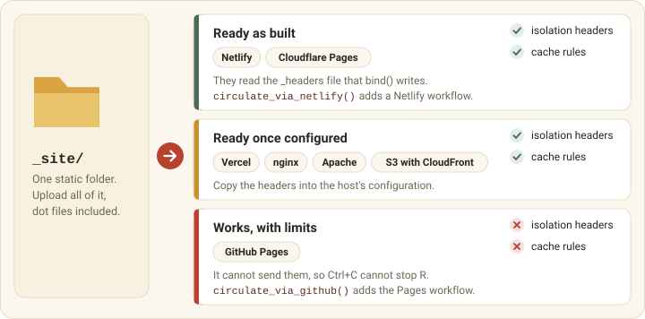

```{r}
#| include: false
knitr::opts_chunk$set(
  collapse = TRUE,
  comment = "#>",
  eval = FALSE
)
```

`bind()` writes a static site, and a static site runs on anything that can
serve files. Upload the whole `_site/` directory, dot files included.

{#fig-options fig-alt="The _site folder goes to any static host, in three groups. Netlify and Cloudflare Pages are ready as built, because they read the _headers file that bind() writes. Vercel, nginx, Apache and S3 with CloudFront are ready once you copy the headers into their configuration. GitHub Pages works with limits, because it sends neither the isolation headers nor cache rules"}

## Cross-origin isolation

webR runs fastest on pages served with two headers. They are tedious to spell
and worth the trouble.

```text
Cross-Origin-Opener-Policy: same-origin
Cross-Origin-Embedder-Policy: require-corp
```

Without them webR still works, on a slower channel where Ctrl+C cannot
interrupt R, and `readline()`, `menu()` and `browser()` do not work. The
console says so and points at the **Restart R** button, which restarts R with
the site's packages, files and startup script. The editor's files survive a
restart, and the session's objects do not. Requests made with curl or httr2
need the headers too ([HTTP requests](#http-requests)).

Hosts differ in whether they send the headers.

| Host | Sends the headers? | How |
|------|--------------------|-----|
| Netlify | yes | the `_headers` file `bind()` writes into the site |
| Cloudflare Pages | yes | the same `_headers` file |
| Vercel, nginx, Apache, S3 with CloudFront | yes, once configured | your own configuration (below) |
| GitHub Pages | no | GitHub Pages cannot set response headers |
| GitLab Pages | only if the instance's administrator adds them | the instance's configuration |
| `reading_room()` | yes | always |

### HTTP requests

A browser gives WebAssembly no network sockets, so R reaches other servers in
two ways.

- `download.file()` and functions that read a URL, such as `readLines()` and
  `read.csv()`, work on every host. They only fetch (a `GET` request), and
  only from servers that allow requests from other sites (CORS), as GitHub's
  API and `raw.githubusercontent.com` do.
- curl and httr2 send any request to any server, from a page served with the
  isolation headers. curl 7.1.0 and later pass the connection through a public
  WebSocket proxy, `ws.r-universe.dev`, with nothing to set up. The proxy sees
  which server a request goes to, and an HTTPS request stays encrypted between
  R and that server.

Without the headers a curl or httr2 request waits ten seconds and fails.

```text
Failed to perform HTTP request.
Caused by error in `curl::curl_fetch_memory()`:
! Timeout was reached [api.github.com]:
Connection timed out after 10000 milliseconds
```

## GitHub Pages

One call writes the workflow.

```{r}
library(webrarian)

circulate_via_github()
```

This writes `.github/workflows/deploy-webr.yml`. On every push to `main` or
`master` the workflow installs the webrarian release that wrote it, runs `bind()`, and
publishes with GitHub's Pages actions. Pull requests build without
publishing. Three steps turn it on.

1. Commit and push the workflow.
2. In **Settings > Pages**, set **Source** to **GitHub Actions**.
3. Open the site at `https://<user>.github.io/<repository>/`.

`overwrite = TRUE` replaces an existing workflow. For a custom domain, set it
in **Settings > Pages > Custom domain** (a `CNAME` file is ignored).

GitHub Pages sends neither the isolation headers nor caching headers, so sites
there run without Ctrl+C and without curl or httr2 requests
([HTTP requests](#http-requests)). The [service worker](#the-service-worker)
helps with repeat visits.

## Netlify

Netlify takes one call too.

```{r}
circulate_via_netlify()
```

This writes two files. `netlify.toml` tells Netlify to publish `_site/` and
sets no headers. `.github/workflows/netlify-deploy.yml` builds on GitHub,
because Netlify's build image has no R, and deploys with the Netlify CLI. Add
two repository secrets, `NETLIFY_AUTH_TOKEN` and `NETLIFY_SITE_ID`.

Every header the site needs is in `_site/_headers`, so a manual deploy
(dragging `_site/` onto <https://app.netlify.com/drop>) gets the same
headers. If you keep your own `netlify.toml` with `[[headers]]` rules,
`bind()` leaves those paths out of `_headers`.

## Cloudflare Pages

Publish `_site/` as the output directory. Cloudflare reads `_headers`, so
nothing else is needed.

## Other hosts

Send the two isolation headers with every response, copy the cache rules from
`_site/_headers` (see [Caching](#caching)), and serve `.wasm` as
`application/wasm`. Vercel reads `vercel.json` in the published directory.

```json
{
  "headers": [
    {
      "source": "/(.*)",
      "headers": [
        { "key": "Cross-Origin-Opener-Policy", "value": "same-origin" },
        { "key": "Cross-Origin-Embedder-Policy", "value": "require-corp" }
      ]
    }
  ]
}
```

nginx drops the server's `add_header` lines in any `location` that adds its
own, so repeat them.

```nginx
server {
    listen 443 ssl;
    server_name r.example.com;
    root /var/www/my-site;

    add_header Cross-Origin-Opener-Policy "same-origin" always;
    add_header Cross-Origin-Embedder-Policy "require-corp" always;
    add_header Cache-Control "no-cache" always;

    location ~ ^/(webr/|exlibris-r\.|library/) {
        add_header Cross-Origin-Opener-Policy "same-origin" always;
        add_header Cross-Origin-Embedder-Policy "require-corp" always;
        add_header Cache-Control "public, max-age=31536000, immutable" always;
    }
}
```

For S3, put CloudFront in front with a response headers policy. Sites work
from a sub-path (`https://example.com/tools/r/`). Outside `localhost` and
`127.0.0.1`, serve over HTTPS.

## Offline sites

With `build.offline: true` the page contacts no other server. `bind()` copies
the engine and every package into the site and does not link a brand's Google
or Bunny fonts (fonts with `source: file` still work). Visitors can install
only bundled packages. The site then runs on a network with no internet access
([Managing Packages](packages.html#runtime-repositories)).

## License notices

Every site lists what it redistributes in `LICENSES/`.

| File | Covers |
|------|--------|
| `webrarian.md` | webrarian's output exception, which makes the files webrarian generates yours to license |
| `exlibris.md` | the exlibris viewer's AGPL-3 license, the runtime exception that lets you publish the unmodified bundle, and a source link |
| `THIRD-PARTY-r.md` | the third-party code inside the viewer |
| `webR.md` | the webR engine's licenses (GPL-3 for R, MIT for the JavaScript client) |
| `PACKAGES.md` | every bundled R package with its version, license and source |
| `index.html` | a page linking the files above |

Bundled packages are distributed under their own licenses. When you bundle a
local package under a GPL-family license, `bind()` reminds you that its source
must be available, for example by publishing it on GitHub and bundling it from
there.

## Caching

Files named after their content are kept for a year, the rest are rechecked,
and `_site/_headers` carries the rules.

| Path | Cache rule | Why |
|------|------------|-----|
| `webr/v<version>/` | kept for a year, never rechecked | a new webR version is a new directory |
| `exlibris-r.<hash>.js`, `.css` | kept for a year, never rechecked | the name changes with the content |
| `library/library-<hash>.tgz` | kept for a year, never rechecked | the name changes with the packages |
| `index.html`, `vfs-files/`, `repo/`, `LICENSES/`, `packages.json`, `sw.js` | rechecked on every visit | rewritten by every build at the same URL |

Rechecking (`Cache-Control: no-cache`) costs a short "not modified" answer, not
a download. Netlify and Cloudflare Pages apply `_headers`, and elsewhere you
copy the rules.

### The service worker

Hosts that send no caching headers, such as GitHub Pages, can lean on a
service worker.

```yaml
# _webrarian.yml
build:
  service-worker: true
```

`bind()` writes `_site/sw.js`, which caches the engine, viewer and library
image (their URLs change with their content) and fetches the page and files
from the network first. It speeds up repeat visits but does not make the site
work offline. Every build without the option writes an `sw.js` that removes
an earlier worker. Visitors with the page open see changes after a reload. To
debug, use "Update on reload" under **Application > Service workers** in the
browser's developer tools.

## Other CI services

Any CI that runs R can build the site. Here is the job for GitLab.

```yaml
# .gitlab-ci.yml
pages:
  image: rocker/r-ver:4.6
  script:
    - Rscript -e 'install.packages("webrarian", repos = c("https://coatless-wasm.r-universe.dev", "https://cloud.r-project.org"))'
    - Rscript -e 'webrarian::bind()'
    - mv _site public
  artifacts:
    paths:
      - public
  rules:
    - if: $CI_COMMIT_BRANCH == $CI_DEFAULT_BRANCH
```

Collections with local or GitHub packages also need Docker in the job.

## Failed deployments

Work through these checks when a deployed site fails.

1. Look for 404s in the browser's developer tools, which usually mean files
   were left out of the upload.
2. Rule out the isolation headers. Missing ones slow webR and disable Ctrl+C
   but do not stop the site.
3. Check that the site is served over HTTPS.

See also [Troubleshooting](troubleshooting.html).
