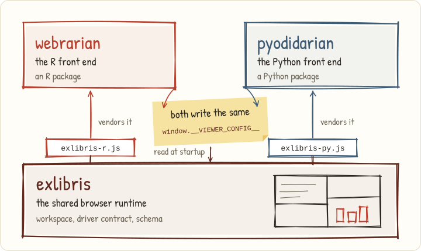

```{r}
#| include: false
knitr::opts_chunk$set(
  collapse = TRUE,
  comment = "#>",
  eval = FALSE
)
```

```{r}
#| label: pin
#| include: false
#| eval: true
# The vendored viewer's provenance, read from the installed package so this
# page always names the bundle that ships with it. When the render cannot see
# the install (Quarto on Windows during R CMD build), read the source copy.
prov <- system.file("viewer", "PROVENANCE.json", package = "webrarian")
if (!nzchar(prov)) prov <- file.path("..", "inst", "viewer", "PROVENANCE.json")
pin <- jsonlite::read_json(prov)
pin_commit <- substr(pin$exlibrisCommit, 1, 12)
```

webrarian has two halves, and only one of them is written in R. The R half
models a collection, fetches WebAssembly packages, copies files and writes the
site. The browser half is **exlibris**, a separate project whose prebuilt
JavaScript bundle ships in `inst/viewer/` and is copied into every site. You
need no Node and no JavaScript toolchain.

{#fig-ecosystem fig-alt="A hand-drawn sketch. exlibris, the shared browser runtime with the workspace, the driver contract and the schema, builds one bundle for R and one for Python. webrarian vendors the R bundle and pyodidarian the Python one, both write the same window.__VIEWER_CONFIG__, and the bundle reads it at startup"}

## Responsibilities

webrarian owns `_webrarian.yml`, package resolution, Docker compilation, the
engine cache, deployment helpers and `collection_mirror()`. exlibris owns the
page once it loads, including the workspace panels, the webR driver (startup,
package installs or the mounted library image, the file system, plots, help,
restarts), share links, stored edits, the `exlibris-embed/1` protocol
and the sanitizer for rich output.

Your installed webrarian pins the viewer, so a newer viewer means a newer
webrarian. `webr.version` selects only the R engine.

## The shared contract

`bind()` writes one `ViewerConfig` object into `index.html`, above the script
that loads the bundle.

```html
<script>window.__VIEWER_CONFIG__ = {"schema-version":1,"engine":"webr", ... };</script>
```

For a collection with two packages and one file, part of it reads as follows.

```json
{
  "schema-version": 1,
  "engine": "webr",
  "engine-version": "0.6.0",
  "engine-base-url": "./webr/v0.6.0/",
  "packages": {
    "install": ["dplyr", "ggplot2"],
    "repos": ["https://repo.r-wasm.org"],
    "repo-url": "./repo",
    "library-images": ["./library/library-<hash>.tgz"]
  },
  "files": [
    {
      "name": "analysis.R",
      "vfs-path": "/home/web_user/analysis.R",
      "fetch-path": "vfs-files/analysis.R"
    }
  ],
  "mount-point": "/home/web_user",
  "auto-open": ["/home/web_user/analysis.R"],
  "share-links": "open",
  "persist-edits": true
}
```

`engine-base-url` is the site's own engine, or `https://webr.r-wasm.org/v0.6.0/`
with `build.bundle-engine: false`. Packages come from the mounted
`library-images`, or failing that from `repo-url`, then `repos`. An offline site adds
`"offline": true` with an empty `repos`. A short script after the object makes
its URLs absolute, which is why sites work from a sub-path.

exlibris defines the object's shape as a TypeScript type and a JSON Schema.
webrarian builds the object independently in R, so it vendors the schema as
`inst/viewer-config.schema.json` and its tests validate real builds against
it. Unknown fields are rejected.

## Auditing the prebuilt bundle

A minified bundle is hard to read, so `inst/viewer/` carries what you need to
check it.

| File | What it is |
|------|------------|
| `exlibris-r.js`, `exlibris-r.css` | the bundle, minified |
| `index.html` | the page `bind()` fills in |
| `PROVENANCE.json` | the exlibris commit and ref, and a SHA-256 for every vendored file |
| `THIRD-PARTY.md` | every npm package in the bundle, with its version, license and nested notices |
| `EXCEPTION.md` | the exlibris runtime exception |
| `LICENSE.webR.md` | the webR notice |

This installation's bundle comes from exlibris `r pin$exlibrisRef`, commit
`r pin_commit`, and embeds version `r pin$webrClientVersion` of the webR
JavaScript client.

```{r}
system.file("viewer", "PROVENANCE.json", package = "webrarian")
system.file("viewer", "THIRD-PARTY.md", package = "webrarian")
system.file("viewer-config.schema.json", package = "webrarian")
```

webrarian's tests re-hash each installed file against `PROVENANCE.json`, and
CI rebuilds exlibris at the recorded commit and compares the result. Of webR,
the bundle holds only the JavaScript client. The WebAssembly build of R is copied
into the site or loaded from webr.r-wasm.org, as `LICENSES/` records.

## The Python counterpart

**pyodidarian**, released separately, does for Python and Pyodide what
webrarian does for R. It uses the same exlibris workspace, the same function
names (`catalog()`, `acquire_package()`, `bind()`, `reading_room()`,
`collection_mirror()`) and the same keys in `_pyodidarian.yml` wherever the
languages agree. webrarian's functions differ from pyodidarian's in these
ways.

- `bind()` has no `upgrade` or `locked` argument, because webrarian keeps no lock file.
- `collection_mirror()` also takes `repos` and `favicon`.
- `reading_room(watch = TRUE)` needs `block = TRUE`.
- `reading_room()`'s `open_browser` defaults to `rlang::is_interactive()`.
- `check_inventory()` returns a data frame rather than a list of rows.
- `acquire_package()` adds a prebuilt package that no repository has, with a
  warning, where pyodidarian's refuses it.
- `webr_cache_clear()` asks before clearing everything in an interactive
  session, but pyodidarian's `pyodide_cache_clear()` never asks.
- `collection_mirror()` returns the mirror's directory, invisibly, rather
  than a bind result.
- `diagnose_collection()` files each problem under an `area` of `"network"`,
  `"config"`, `"tools"` or `"packages"`, while pyodidarian uses its own areas.

exlibris, webrarian and pyodidarian are released under AGPL-3. exlibris's
exception lets you publish its unmodified bundle in a generated site, and
webrarian's exception covers the files it generates, so a site you build is
yours to license.
