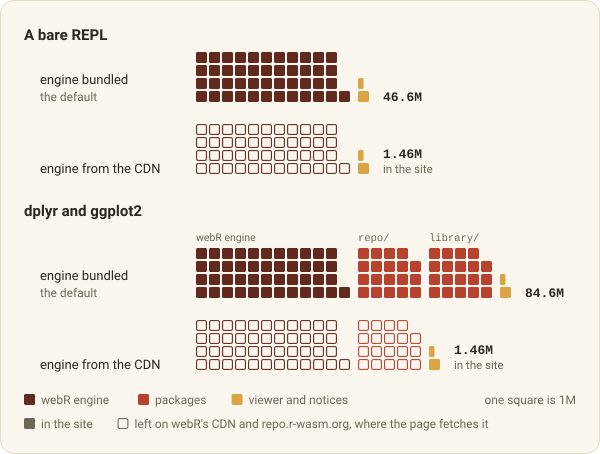

```{r}
#| include: false
knitr::opts_chunk$set(
  collapse = TRUE,
  comment = "#>",
  eval = FALSE
)
```

webrarian builds static websites where R runs in the visitor's browser, through
[webR](https://docs.r-wasm.org/webr/latest/). The page opens with an editor, an R
console, a file browser and a plot panel, and your packages and files are
already in place. Visitors install nothing and no server runs R, which leaves
little to maintain.

{#fig-workflow fig-alt="Five numbered notes sit beside the lines of a short R script, each joined to its line by a short arrow. catalog() starts a collection, acquire_package() and acquire_file() add packages and files, bind() builds _site/, reading_room() previews it and circulate_via_github() sets up publishing"}

A site takes five steps.

1. `catalog()` starts a collection.
2. `acquire_package()` and `acquire_file()` add packages and files.
3. `bind()` builds the site.
4. `reading_room()` previews it.
5. `circulate_via_github()` or `circulate_via_netlify()` sets up deployment.

## Installation

webrarian installs from its r-universe.

```{r}
install.packages(
  "webrarian",
  repos = c("https://coatless-wasm.r-universe.dev", "https://cran.r-project.org")
)

# The preview server needs httpuv
install.packages("httpuv")
```

webrarian needs R 4.4 or later. Docker is optional, needed only to compile
local and GitHub packages ([Managing Packages](packages.html)).

## Your first site

### 1. Start a collection

Give `catalog()` a directory name.

```{r}
library(webrarian)

catalog("my-analysis")
```

This creates `my-analysis/` with a `_webrarian.yml` in it, which holds the
collection's settings. Every function that works on a collection takes a
`path`. It defaults to the working directory, and any directory inside the
collection will do, so you can work inside `my-analysis/` or pass
`path = "my-analysis"`, as the code below does.

::: {.callout-tip title="Starting from an existing project"}
Run `catalog()` in a directory that already holds R files and it reads them
first. The packages they load (`library()`, `require()`, `pkg::fun()`) and the
files it finds go straight into `_webrarian.yml`.

{#fig-autodetect fig-alt="A file tree of my-analysis with analysis.R, helpers.R, import.R and data/sales.csv, and a line from each R file, library(dplyr), library(stringr) and readr::read_csv(path). catalog() turns it into a _webrarian.yml listing dplyr, readr and stringr plus the file patterns *.R and data/, with matching highlights on both sides"}

Detecting packages needs the renv package. `catalog(detect = FALSE)` skips the
scan.
:::

### 2. Add packages

Name the packages, then ask whether each has a WebAssembly build.

```{r}
acquire_package(c("dplyr", "ggplot2"), path = "my-analysis")
check_inventory(c("dplyr", "ggplot2"), path = "my-analysis")
```

Both are CRAN packages, prebuilt for WebAssembly at repo.r-wasm.org.
`check_inventory()` says whether a package has a build, which is better
learned before `bind()` than after.

### 3. Add files

`acquire_file()` adds files that already exist inside the collection, so make
some first.

```{r}
dir.create("my-analysis/data")
write.csv(mtcars, "my-analysis/data/mtcars.csv", row.names = FALSE)
dir.create("my-analysis/scripts")
writeLines(
  c('mt <- read.csv("data/mtcars.csv")', "summary(mt)"),
  "my-analysis/scripts/analysis.R"
)

acquire_file(c("data/", "scripts/*.R"), path = "my-analysis")
```

`data/` takes everything under `data/`, and `scripts/*.R` takes the R files
directly inside `scripts/`. A pattern that matches nothing is an error, on the
theory that you meant something. R starts in the directory that holds the
files, so the script's relative path works in the browser as it does on your
machine. [Bundling Files](files.html) has the pattern rules.

### 4. Build

One call builds the site.

```{r}
site <- bind("my-analysis")
```

`bind()` writes the site into `my-analysis/_site/` and ends with a size
breakdown.

```text
Build complete! Output size: 84.6M (engine 45.1M, packages 38M, files 1.32K, viewer 1.51M)
```

The first build downloads the webR engine (about 38M, compressed) into
webrarian's cache, and later builds reuse it. `bind()` works in a staging
directory and replaces `_site/` only on success, so a failed build never leaves
you with half a site. It also names any bundled package that trails CRAN.

### 5. Preview

One more serves it.

```{r}
reading_room("my-analysis")
```

This serves `_site/` at a local address such as `http://127.0.0.1:8123` and
opens it in your browser. Press Ctrl+C (Esc in RStudio) to stop it.

{#fig-browser fig-alt="A browser window at my-analysis.netlify.app showing the workspace. Numbered callouts mark the editor holding analysis.R, the console after installing packages and running the script, the Files tab with the file tree under web_user, the Plots tab with a bar chart, the footer with Reset files, and the address bar"}

The server holds your R prompt until you stop it. To keep the prompt, run the
server in the background.

```{r}
room <- reading_room("my-analysis", block = FALSE)
room$url
reading_room_close(room)
```

`reading_room("my-analysis", watch = TRUE)` rebuilds whenever
`_webrarian.yml` or a bundled file changes, then reloads the open page. It
blocks the prompt, so it does not combine with `block = FALSE`.

When the preview looks right, publish with `circulate_via_github()` or
`circulate_via_netlify()` ([Deployment](deployment.html)).

## Site contents

The engine and the packages take most of the room in `_site/`.

{#fig-anatomy fig-alt="A blueprint of _site/ with rooms sized roughly by file size. The webR engine in webr/v0.6.0/ is the largest at 45.1M, beside repo/ and library/, the packages as a repository and as one installed image, 38M together for dplyr and ggplot2. Along the front are index.html, where visitors enter, the exlibris-r bundle, vfs-files/ and a small room for _headers, sw.js, LICENSES/, packages.json, assets/ and .webrarian-build"}

Here is the same directory as a listing.

```text
_site/
├── index.html              the page, with the viewer's settings written in
├── exlibris-r.<hash>.js    the viewer, named after a hash of its contents
├── exlibris-r.<hash>.css
├── webr/v0.6.0/            the webR engine (unless build.bundle-engine is false)
├── repo/                   bundled packages and their index
├── library/                the same packages installed, as one image the page mounts
├── packages.json           the bundled packages' versions, compared with CRAN
├── vfs-files/              your files, at their own paths
├── assets/                 favicon, logo, fonts and custom CSS, when set
├── LICENSES/               licenses of everything the site redistributes
├── _headers                response headers for Netlify and Cloudflare Pages
├── sw.js                   the service worker, or one that removes it
└── .webrarian-build        marks the directory as webrarian's output
```

Upload the whole directory to any static host.

## Site size

Two settings, `build.bundle-engine` and `build.offline`, decide how much the
site carries.

- `build.bundle-engine: true` (the default) copies the webR engine and every
  prebuilt package into the site.
- `build.bundle-engine: false` leaves them out. The page loads the engine from
  webR's CDN and installs packages from repo.r-wasm.org.
- `build.offline: true` copies everything in, whatever `build.bundle-engine`
  says. The page then contacts no other server, so visitors can add only the
  packages the site bundles. It defaults to `false`.

The table gives sizes measured with webR 0.6.0, as `bind()` reports them (1M is
1,048,576 bytes).

| Site | Mode | On disk | Engine | Packages | Viewer and notices |
|------|------|---------|--------|----------|--------------------|
| Bare REPL | engine bundled (default) | 46.6M | 45.1M | 0 | 1.5M |
| Bare REPL | engine from CDN | 1.46M | 0 | 0 | 1.46M |
| dplyr and ggplot2 | engine bundled (default) | 84.6M | 45.1M | 38M | 1.51M |
| dplyr and ggplot2 | engine from CDN | 1.46M | 0 | 0 | 1.46M |

{#fig-size fig-alt="A unit chart with one square per megabyte, filled when the site holds it and hollow when the page fetches it from webR's CDN or repo.r-wasm.org. A bare REPL holds 46.6M with the engine bundled and 1.46M with the engine from the CDN. A site with dplyr and ggplot2 holds 84.6M with the engine bundled, where the 38M of packages is 19M in repo/ and 19M in library/, and still 1.46M with the engine from the CDN, when the page fetches the engine and 19M of packages"}

Bundled packages are stored twice, and the table counts both copies. `repo/`
holds them as a repository, and `library/` holds them installed, as one image
the page mounts instead of installing each package on every visit
([Managing Packages](packages.html#faster-page-loads-the-package-library-image)).
Visitors download less than the site holds, because webR fetches most of R's
files only when it needs them and hosts compress responses. Repeat visits come
from the browser's cache ([Deployment](deployment.html#caching)).

## A bare REPL

Packages and files are optional.

```{r}
catalog("scratch")
bind("scratch")
```

That is an R console on a web page, with base R and nothing else. It makes a
fine teaching sandbox.

## Settings

A collection's `_webrarian.yml` might look like this.

```yaml
# _webrarian.yml
project:
  name: "my-analysis"

webr:
  version: "0.6.0"

packages:
  prebuilt:
    - dplyr
    - ggplot2

files:
  include:
    - "data/"
    - "scripts/*.R"
  mount-point: "/home/web_user"

repl:
  auto-open:
    - "scripts/analysis.R"

build:
  output-dir: "_site"
  bundle-engine: true
```

Keys are lowercase with hyphens. Edit the file by hand or use
`settings_set()`.

```{r}
settings_set("my-analysis", "build.bundle-engine" = FALSE)
settings_get(collection_settings("my-analysis"), "build.bundle-engine")
```

`settings_set()`, `acquire_*()` and `withdraw_*()` rewrite the whole file, so
comments in it do not survive. The
[configuration reference](config-reference.html) lists every key.

## Next steps

The other guides pick up where this one stops.

- [Managing Packages](packages.html) covers prebuilt, r-universe, GitHub and
  local packages.
- [Bundling Files](files.html) covers which files are included and where they
  appear.
- [Customization](customization.html) covers branding, the loading screen,
  startup scripts and share links.
- [Deployment](deployment.html) covers GitHub Pages, Netlify and other hosts.
- [Choosing webrarian](when-to-use.html) compares it with shinylive,
  quarto-live and the webR REPL.
