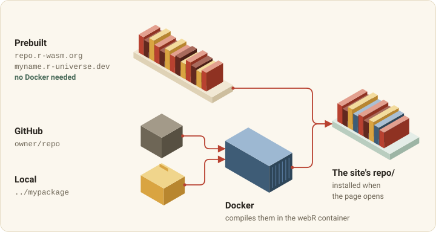
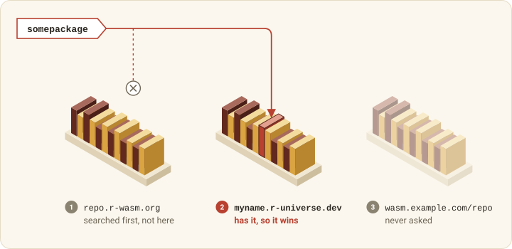

```{r}
#| include: false
knitr::opts_chunk$set(
  collapse = TRUE,
  comment = "#>",
  eval = FALSE
)
```

A collection's packages are installed when the page opens, so visitors can
call `library()` straight away. A browser cannot run a package compiled for
your laptop, only one compiled to WebAssembly, and webrarian gets those from
three sources.

{#fig-sources fig-alt="Packages drawn as books. Prebuilt ones go from a shelf at repo.r-wasm.org or an r-universe straight to the site's repo/, with no Docker. GitHub and local packages go through Docker, which compiles them in the webR container, and join the same shelf"}

## Prebuilt packages

Most CRAN packages have a WebAssembly build at repo.r-wasm.org. Adding one
takes only its name.

```{r}
library(webrarian)

acquire_package("dplyr")
acquire_package(c("ggplot2", "tidyr", "purrr"))
```

`acquire_package()` adds the names to `packages.prebuilt`. It looks them up in
repo.r-wasm.org and your `packages.repos`, and warns about any name no
repository has, which usually means a typo or a package with no WebAssembly
build.
The package is added either way, and without a network connection the check is
skipped.

Packages that need system libraries webR lacks have no build, so check before
you count on one.

```{r}
check_inventory(c("dplyr", "ggplot2", "rJava"))
```

`check_inventory()` returns one row per package with `available`, `version`,
`repository` and `note`, then `cran_version`, `local_version` and `drift`
(see [below](#checking-bundled-versions-against-cran)). With no packages it
checks the collection's list. When no repository answers, `available` is
`NA` with a warning.

### Other repositories

Any [r-universe](https://r-universe.dev) builds WebAssembly binaries, so it
works as an extra repository.

```yaml
# _webrarian.yml
packages:
  prebuilt:
    - dplyr
    - somepackage
  repos:
    - "https://myname.r-universe.dev"
    - "https://wasm.example.com/repo"
```

The search starts at repo.r-wasm.org and goes through `packages.repos` in
order. The first repository with the package provides it, so order
`packages.repos` by preference.

{#fig-resolution fig-alt="A request for somepackage misses the first shelf, repo.r-wasm.org, is found on the second, myname.r-universe.dev from packages.repos, and never reaches the third, wasm.example.com/repo"}

### Dependencies

`packages.dependencies: true` (the default) bundles each package's
dependencies too, leaving out, with a warning, any that no repository has.
`false` bundles only the packages you list.

## Checking bundled versions against CRAN

The WebAssembly repository sometimes lags CRAN by a release.

```{r}
check_inventory(c("dplyr", "rlang"))
#>   package available version ... cran_version local_version  drift
```

`bind()` makes the same comparison for every bundled package, writes the
versions to `packages.json` in the site, and prints one line naming the
packages behind CRAN. CRAN's index is read from `getOption("repos")` at most once a day and
cached. Set `options(webrarian.cran_repo = FALSE)` to skip the comparison.

## Runtime repositories

A site bundles its packages by default
([Site size](getting-started.html#site-size)). The page installs from these
repositories, in order.

| Site | Where the page installs packages from |
|------|---------------------------------------|
| With bundled packages | the site's own `repo/`, then repo.r-wasm.org, then `packages.repos` |
| Without bundled packages | repo.r-wasm.org, then `packages.repos` |
| `build.offline: true`, with bundled packages | the site's own `repo/` |
| `build.offline: true`, without bundled packages | none |

The same list serves the site's packages at startup, `install.packages()` in
the console (webR's `webr_pkg_repos` option), the Packages tab and share
links. With `build.offline: false` (the default) visitors can install any
package those repositories hold. With `build.offline: true` the page never contacts another
server, and asking for a package the site lacks ends with a ✗ and a reason in
the console.

Local and GitHub packages are always bundled in `repo/`, even with
`build.bundle-engine: false`.

## Faster page loads: the package library image

A site that bundles packages in `repo/` also ships them installed, as one file,
`library/library-<hash>.tgz`. The page mounts it instead of installing each
package on every visit. For dplyr, ggplot2 and their dependencies, that is one
file instead of 24 installs. If the image cannot be mounted, the page installs from `repo/`. A
site ships no image when a bundled package depends on one it does not bundle
(for example with `build.bundle-engine: false`).

Two things need care.

- Serve the image as is. A host that adds `Content-Encoding: gzip` to `.tgz`
  files makes webR fail with "Cannot read properties of undefined (reading
  'length')", and the page falls back to `repo/`.
- The image holds every package in one file, which can exceed a host's
  per-file limit (25 MiB on Cloudflare Pages). `bind()` warns above 25 MiB.

One setting leaves the image out.

```yaml
# _webrarian.yml
build:
  library-image: false
```

## GitHub packages

Name the repository and say that it lives on GitHub.

```{r}
acquire_package("user/repo", source = "github")
acquire_package("r-lib/cli@v3.6.0", source = "github")
acquire_package("user/monorepo/pkgs/mypkg@v1.0", source = "github")
```

The name can pin a ref or point into a subdirectory. Pin one, or each build
takes whatever the default branch holds that day.

| Form | Example | Builds |
|------|---------|--------|
| `owner/repo` | `tidyverse/dplyr` | the default branch |
| `owner/repo@ref` | `r-lib/cli@v3.6.0` | a branch, tag or commit |
| `owner/repo/subdir@ref` | `user/monorepo/pkgs/mypkg@v1.0` | the package in `pkgs/mypkg` |

## Local packages

Give the path to the package's directory.

```{r}
acquire_package("../mypackage", source = "local")
```

A relative path starts at the collection, and the directory must hold a
`DESCRIPTION`. Local and GitHub packages are compiled with Docker on every
`bind()`, unless you [avoid Docker](#without-docker).

## Compiling with Docker

Install [Docker Desktop](https://www.docker.com/products/docker-desktop/) and
start it. `bind()` compiles in the webR project's image for your webR version
(`ghcr.io/r-wasm/webr:v0.6.0` for webR 0.6.0). The first pull is about 2 GB,
so the first build is the slow one. The image is x86-64 only, so ARM machines
such as Apple Silicon run it under emulation, more slowly. Then ask webrarian
whether it can see Docker.

```{r}
diagnose_collection()
```

The report says whether Docker is installed and whether its daemon is running.

## Without Docker

Two routes compile your packages on a machine that is not yours.

- On r-universe, add your package (or a GitHub repository) to your universe,
  wait for its build, then list it under `packages.prebuilt` with the universe
  in `packages.repos`.
- On GitHub Actions, the workflow from `circulate_via_github()` runs `bind()`
  on a runner that has Docker, so pushing the collection compiles your
  packages there. [r-wasm/actions](https://github.com/r-wasm/actions) can also
  maintain a WebAssembly repository of your packages for `packages.repos`.

## Managing your package list

List what a collection holds, or take a package back out.

```{r}
collection_packages()   # one row per package: `package` and `source`
withdraw_package("ggplot2")
```

The next `bind()` leaves withdrawn packages out.

## Shiny apps

A webrarian site cannot show a Shiny app's interface. Installing
`shiny` gives you its functions, not a running app. To publish a Shiny app as
a static site, use [shinylive](https://posit-dev.github.io/r-shinylive/).

## Unavailable packages

"Could not obtain requested package" means no repository has a build for your
webR version. Check the spelling (names are case-sensitive), run
`check_inventory()`, and look for the package on an r-universe to add to
`packages.repos`. Packages that need system libraries such as GDAL or JAGS may
not compile for WebAssembly at all. When a GitHub or local package fails to
compile, the compiler output above the error says why (see
[Troubleshooting](troubleshooting.html#a-package-fails-to-compile)).
