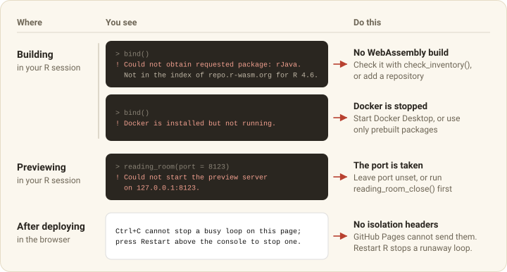

```{r}
#| include: false
knitr::opts_chunk$set(
  collapse = TRUE,
  comment = "#>",
  eval = FALSE
)
```

## Start with diagnose_collection()

`diagnose_collection()` asks the questions you would otherwise ask one error
at a time.

```{r}
library(webrarian)

result <- diagnose_collection()
result$ok
result$problems
```

It checks the network, the tools (Docker included), the settings
and the packages. `result$ok` is `FALSE` when `bind()` would fail, and
`result$problems` has one row per problem with its `severity`, `area` and
`message`. Outside a collection it runs only the network and tool checks.
`check_inventory()` and `collection_files()$files` are the other quick checks.

{#fig-categories fig-alt="A ledger pairing where a problem happens and the message you see with what to do. While building, a package with no WebAssembly build and Docker not running. While previewing, a busy preview port. After deploying, the notice that Ctrl+C cannot stop a busy loop because the host sends no isolation headers"}

The rest of this guide is sorted by when a problem shows up. Messages are
quoted as webrarian prints them, with `<...>` for the part that varies.

## Settings

These come from reading `_webrarian.yml`.

```{.text .message}
Not a webrarian collection
No _webrarian.yml found in <path> or its parent directories
```

Pass the collection's `path`, or run `catalog()` to start one.

```{.text .message}
Config key <key> uses an underscore.
Keys in _webrarian.yml are lowercase with hyphens: <key>.
```

Write `output-dir`, not `output_dir`.

```{.text .message}
<key> is not a webrarian setting and is ignored. Did you mean <key>?
```

This one is a warning, and the build goes on without the key. Fix the
spelling, or look the key up in the
[configuration reference](config-reference.html).

```{.text .message}
<key> in _webrarian.yml must be <type>.
```

Quote versions (`version: "0.6.0"`). YAML reads unquoted `yes`, `no`, `on` and
`off` as true or false, which has surprised nearly everyone at least once.
Only `share-links: off` is read back as `"off"`.

```{.text .message}
webR <version> is not supported by this webrarian's viewer.
```

The message lists the supported versions. Set `webr.version` to one, in
quotes. A newer patch release is accepted with a warning.

## Building

These stop `bind()`.

```{.text .message}
Could not obtain requested package: <package>.
Not in the index of <repository> for R <version>.
```

No repository has a WebAssembly build. Check the spelling, run
`check_inventory()`, and add a repository that has it to `packages.repos`
([Managing Packages](packages.html#other-repositories)).

```{.text .message}
Docker is required to compile local and GitHub packages to WebAssembly.
```

```{.text .message}
Docker is installed but not running.
```

Install or start Docker Desktop. On Linux, add yourself to the `docker` group
(`sudo usermod -aG docker "$USER"`) and log in again. Or
[avoid Docker](packages.html#without-docker).

### A package fails to compile

These come from compiling local and GitHub packages.

```{.text .message}
Compiling packages to WebAssembly failed inside the webR container (exit code <n>).
```

The compiler output above the message says why. Packages that need system
libraries such as GDAL, HDF5 or JAGS often cannot compile for WebAssembly.
Make sure the package installs in ordinary R first, because a package that
fails there will not do better here.

```{.text .message}
Docker could not start the webR build container (exit code <n>).
```

Docker itself failed, usually while pulling the image.

```{.text .message}
Local package <path> has no DESCRIPTION.
```

Point `packages.local` at the directory that holds the package's
`DESCRIPTION`.

### Files

These concern which files are bundled and where the site is written.

```{.text .message}
Include pattern <pattern> matched no files.
```

```{.text .message}
<setting> entry <file> is not one of the bundled files.
```

Compare the entry with `collection_files()$files` and the
[pattern rules](files.html#pattern-rules). `repl.startup-script`,
`repl.auto-open` and `repl.auto-run` must name bundled files.

```{.text .message}
Refusing to replace <directory>: it was not created by webrarian::bind().
```

`bind()` replaces only an output directory it made, inside the collection.
Choose another `build.output-dir` or empty the directory yourself.

### Disk space

`webr_cache_info()` and `webr_cache_clear()` inspect and clear the download
cache, and `clean_shelves()` removes the built site. Each Docker image takes
about 2 GB, and `docker system prune` removes unused ones.

## Previewing

These come from `reading_room()`.

```{.text .message}
Could not start the preview server on <host>:<port>.
```

Leave `port` unset to get a free one, or stop an earlier preview with
`reading_room_close()`.

```{.text .message}
httpuv package is required for preview
```

Run `install.packages("httpuv")`.

```{.text .message}
No built site at <directory>.
```

Run `bind()` first, or `reading_room(watch = TRUE)`, which builds first.

The browser opens only in interactive sessions. Otherwise paste the address
`reading_room()` prints (`room$url` with `block = FALSE`).

## In the browser

These problems show up once the page is open.

- **A file is not found.** R starts in the mount point (`/home/web_user`), so
  relative paths work unless code called `setwd()`. The full path works from
  anywhere. Dot files need a pattern that names the dot.
- **A package does not load.** Check `collection_packages()` and that the last
  `bind()` finished. A `build.offline: true` site installs only bundled
  packages. The Network tab of the developer tools (F12) shows failed
  downloads.
- **A share link adds nothing.** `repl.share-links: "fixed"` takes only files,
  `"off"` ignores links, and offline sites add only bundled packages.

## After deploying

Each of these traces to the host or the upload.

- **Ctrl+C does nothing.** The host does not send the cross-origin isolation
  headers, which GitHub Pages never does (see
  [Deployment](deployment.html#cross-origin-isolation)). **Restart R** stops a
  runaway loop, keeping packages and files but losing the session's objects.
- **A curl or httr2 request ends in `Timeout was reached`.** The same headers
  are missing ([HTTP requests](deployment.html#http-requests)).
  `download.file()` still reaches servers that allow requests from other
  sites.
- **Files return 404.** Upload the whole `_site/`, dot files included.
- **The page shows an old version.** Reload. With the service worker on, an
  open page keeps the old version until then
  ([Caching](deployment.html#caching)).

## Known limitations

Every site has these limits, and they are easier to read than to discover.

- Without cross-origin isolation (GitHub Pages, or a GitLab Pages instance
  whose administrator has not added the headers), Ctrl+C cannot
  interrupt R, `readline()`, `menu()` and `browser()` do not work, and curl
  and httr2 cannot make HTTP requests.
- Packages whose system dependencies have no WebAssembly build cannot be used.
- Shiny apps do not run in the workspace, so use
  [shinylive](https://posit-dev.github.io/r-shinylive/).
- The Help panel shows the first match when a topic exists in several
  packages, and shows mathematics as plain text.
- Visitors' edits stay in their browser
  ([Customization](customization.html#keeping-visitors-edits)), and nothing is
  written back to the site.
- Sites work in current Chrome, Edge, Firefox and Safari. Phones and tablets
  are untested.

## Getting help

Open an issue at <https://github.com/coatless-wasm/webrarian/issues> with
`R.version.string`, `packageVersion("webrarian")`, the output of
`diagnose_collection()`, and the steps that reproduce the problem.
